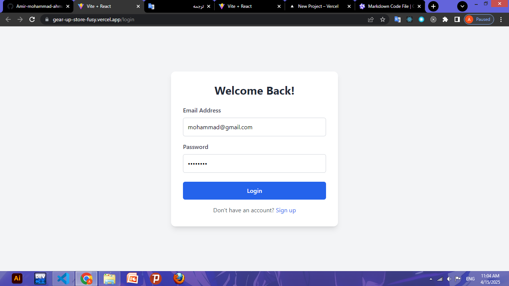
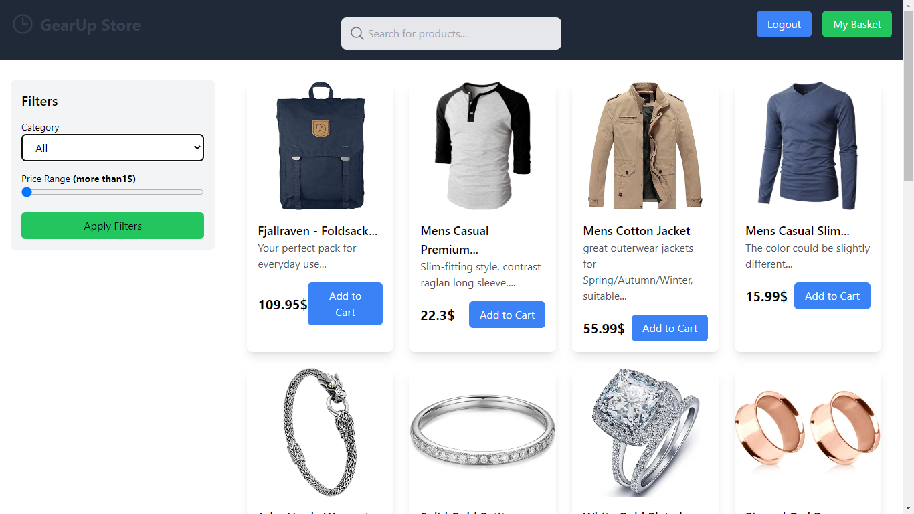
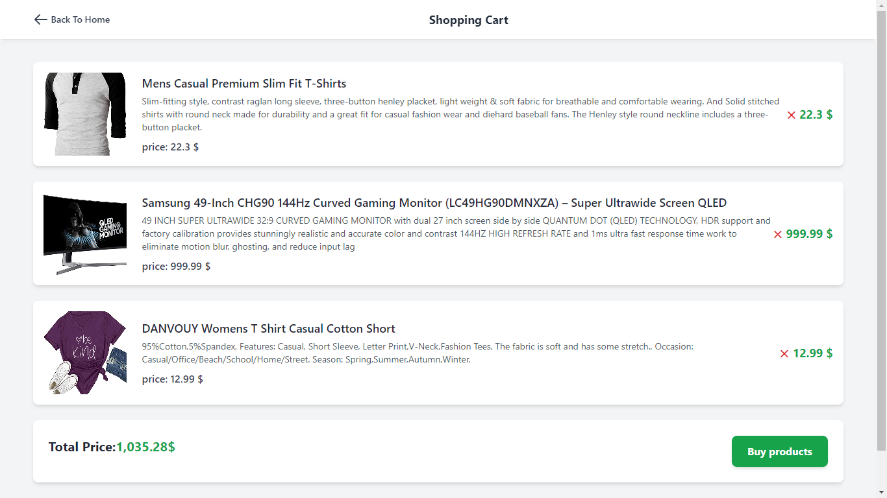

# 🚀 GearUp Store - E-commerce Platform with React & Redux

 

## 📦 Project Overview
Modern e-commerce solution featuring:
- Secure authentication 🔒
- Product management 🛍️
- filtering products 😜
- Shopping cart system 🛒
- Error handling system ❌
- Responsive design 📱

## ✨ Core Features
| Feature | Implementation | Tech Used |
|---------|----------------|-----------|
| User Auth | fake authentication | React Context |
| filtering | Filterable grid | redux algorithm |
| Shopping Cart | Redux persistence | Redux Toolkit |
| Responsive UI | Mobile-first approach | Tailwind CSS |

## 🌐 Live Demo
> [https://gearup-store.vercel.app](https://gear-up-store-fusy.vercel.app/)  
> *Test Register with => email: mohammad@gmail.com / Password: 12345678*

## 📸 Screenshots
### Page View

*Filterable product grid with category navigation*

### User Basket


### Login Page

*Toast notifications for form validations*

## 🛠️ Tech Stack
### Frontend
- React 18 with Vite
- React Router v6
- Redux Toolkit + RTK Query
- Tailwind CSS + DaisyUI


## ▶️ Local Setup
```bash
# Clone repository
git clone https://github.com/yourname/gearup-store.git

# Install dependencies
npm install

# Start development server
npm run dev

# Build for production
npm run build
